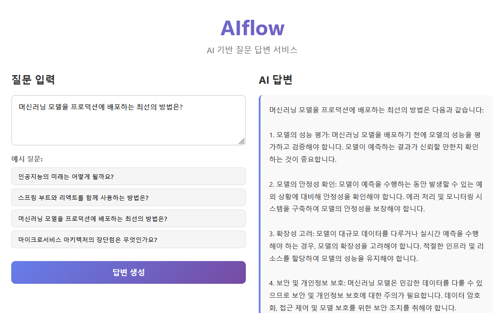

# AIflow - AI 답변 생성 서비스(fullstack)

React 프론트엔드 → Python 전처리 서버 → Spring AI 서버 → OpenAI API를 통한 질문 답변 생성 시스템입니다.

## 프로젝트 구조

```
AIflow/
├── frontend/              # React 프론트엔드
├── python-preprocessor/   # Python Flask 전처리 서버
└── spring-ai-server/      # Spring Boot + Spring AI 서버
```

## 아키텍처

1. **React 프론트엔드**: 사용자가 질문을 입력하고 "답변 생성" 버튼을 클릭
2. **Python 전처리 서버**: 질문을 전처리 (공백 정리, 형식 검증 등)
3. **Spring AI 서버**: Spring AI를 통해 OpenAI API를 호출하여 답변 생성

### 시스템 흐름도
 


**주요 컴포넌트:**
- **React**: `App.jsx` → `handleGenerateAnswer()` → `AnswerService.generateAnswer()`
- **Python**: `app.py` → `generate_answer()` → `preprocess_question()`
- **Spring AI**: `AiController.generateAnswer()` → `AiService.generateAnswer()` → `ChatModel.call()`

## 사전 요구사항

- Node.js 16+ 및 npm
- Python 3.8+
- Java 21 (JDK 21)
- Gradle 8.5+ (또는 Gradle Wrapper 사용)
- OpenAI API 키

## 설치 및 실행

### 🚀 빠른 시작

#### Windows Command Prompt / PowerShell 사용 시:

**프로젝트 루트 디렉토리** 에서:

```bash
# 모든 서비스를 한번에 시작
start-all.bat
```

또는 각 서비스를 개별적으로 시작:

```bash
# Spring AI 서버만 시작
start-spring-server.bat

# Python 전처리 서버만 시작
start-python-server.bat

# React 프론트엔드만 시작
start-frontend.bat
```

#### Git Bash 사용 시:

**프로젝트 루트 디렉토리** 에서:

```bash
# 실행 권한 부여 (처음 한 번만)
chmod +x start-all.sh start-python-server.sh

# 모든 서비스를 한번에 시작
./start-all.sh
```

또는 각 서비스를 개별적으로 시작 (새 터미널 창에서):

```bash
# 터미널 1: Spring AI 서버
cd spring-ai-server
./gradlew bootRun
# 또는 gradlew.bat bootRun

# 터미널 2: Python 서버
cd python-preprocessor
source venv/Scripts/activate
pip install -r requirements.txt
python app.py

# 터미널 3: React 프론트엔드
cd frontend
npm install  # 처음 한 번만
npm run dev
```

---

### 📝 수동 실행 방법

### 1. Spring Boot 서버 실행

```bash
cd spring-ai-server

# OpenAI API 키는 application.yml에 이미 설정되어 있습니다.

# Gradle로 실행
./gradlew bootRun

# Windows의 경우
gradlew.bat bootRun
```

Spring Boot 서버는 `http://localhost:8080`에서 실행됩니다.

### 2. Python 전처리 서버 실행

#### Windows Command Prompt 사용 시:
```bash
cd python-preprocessor

# 가상환경 생성
python -m venv venv

# 가상환경 활성화
venv\Scripts\activate

# 패키지 설치
pip install -r requirements.txt

# 서버 실행
python app.py
```

#### Git Bash (MINGW64) 사용 시:
```bash
cd python-preprocessor

# 가상환경 생성
python -m venv venv

# 가상환경 활성화 (Git Bash는 source 명령어와 슬래시 사용)
source venv/Scripts/activate

# 패키지 설치
pip install -r requirements.txt

# 서버 실행
python app.py
```

#### Linux/Mac 사용 시:
```bash
cd python-preprocessor

# 가상환경 생성
python -m venv venv

# 가상환경 활성화
source venv/bin/activate

# 패키지 설치
pip install -r requirements.txt

# 서버 실행
python app.py
```

Python 서버는 `http://localhost:5000`에서 실행됩니다.

### 3. React 프론트엔드 실행 (Vite)

```bash
cd frontend

# 패키지 설치
npm install

# 환경 변수 설정 (선택사항)
# .env 파일 생성:
# VITE_API_URL=http://localhost:5000

# 개발 서버 실행
npm run dev
```

React 앱은 `http://localhost:3000`에서 실행됩니다.

## 사용 방법

1. 브라우저에서 `http://localhost:3000` 접속
2. 질문을 입력하거나 예시 질문 중 하나를 선택
3. "답변 생성" 버튼 클릭
4. AI가 생성한 답변 확인

## 예시 질문

- "인공지능의 미래는 어떻게 될까요?"
- "스프링 부트와 리액트를 함께 사용하는 방법은?"
- "머신러닝 모델을 프로덕션에 배포하는 최선의 방법은?"
- "마이크로서비스 아키텍처의 장단점은 무엇인가요?"

## API 엔드포인트

### Python 전처리 서버
- `POST /api/generate-answer` - 답변 생성 요청
- `GET /health` - 헬스 체크

### Spring AI 서버
- `POST /api/ai/generate` - AI 답변 생성
- `GET /api/ai/health` - 헬스 체크

## 환경 변수

### Spring Boot
- `OPENAI_API_KEY`: OpenAI API 키 (필수)

### React (Vite)
- `VITE_API_URL`: Python 서버 URL (기본값: http://localhost:5000)

## 기술 스택

- **Frontend**: React 18, Vite, Axios
- **Python**: Flask, Flask-CORS, Requests
- **Backend**: Spring Boot 3.2, Spring AI 1.0.0-M3, Lombok
- **AI**: OpenAI GPT-3.5-turbo

## 주의사항

- Spring AI는 반드시 사용되어야 하며, OpenAI API 키를 직접 사용하면 안 됩니다.
- 모든 서버가 실행되어 있어야 정상적으로 작동합니다.
- OpenAI API 사용 시 비용이 발생할 수 있습니다.



